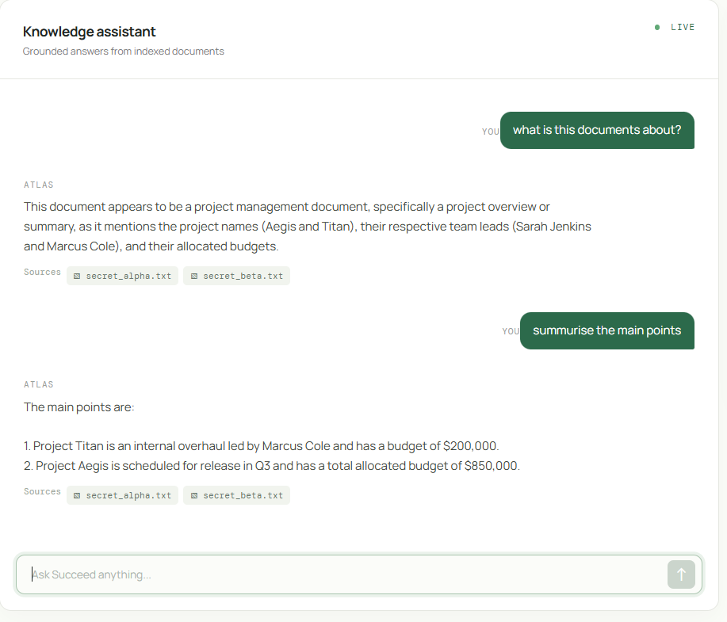

# 🏢  Multi-Tenant Local RAG System

A privacy-focused, fully local Retrieval-Augmented Generation (RAG) platform designed for multi-tenant architectures. It isolates each tenant's documents, vector embeddings, and search spaces using **Qdrant payload filtering** and **local Ollama models**, guaranteeing zero cross-tenant data leakage without relying on external cloud APIs.

---

## 📸 Visual Walkthrough

### 1. Web Application Overview
The main interface features an active tenant selector, file ingestion tools, and an isolated chat environment.


---

### 2. Document Ingestion Pipeline
Tenants upload `.pdf` or `.txt` files directly through the dashboard. Documents are automatically chunked, embedded via local models, and indexed under the active tenant's context.


---

### 3. Isolated Tenant Code & Session Generation
Each tenant operates in complete logical isolation. Dynamic tenant tagging enforces boundary checks across every upload and retrieval request.


---

### 4. Knowledge Assistant
All can ask about their information from the Documents



### 4. Vector & Database Inspection
Stored document chunks, metadata, and tenant IDs indexed inside the database. Records remain partitioned so queries from one tenant cannot see data from another.


---

## ⚡ Core Architecture

* **Multi-Tenant Isolation:** Enforced via Qdrant payload filters (`tenant_id: <id>`) and dedicated keyword indices.
* **100% Local Inference:**
  * **Embeddings:** `nomic-embed-text` (768-dim) via Ollama.
  * **LLM Engine:** `llama3.2` via Ollama.
* **Persistent Storage:** Disk-backed Qdrant collection with crash-resilient locks.
* **Document Parser:** PyPDF and LangChain recursive character text splitters.

---

## 🚀 Quick Start

### 1. Prerequisites
* Python 3.10+
* [Ollama](https://ollama.com/) running locally

Pull required models:
```bash
ollama run llama3.2
ollama pull nomic-embed-text
```

### 2. Start the backend

From the project root, activate the included virtual environment and start FastAPI:

```powershell
.\Scripts\Activate.ps1
python -m uvicorn backend.main:app --reload --host 127.0.0.1 --port 8000
```

The API is available at `http://127.0.0.1:8000`. The interactive API documentation is available at `http://127.0.0.1:8000/docs`.

### 3. Start the frontend

Open a second terminal:

```powershell
cd frontend
npm install
npm run dev
```

Open the Vite URL shown in the terminal, usually `http://localhost:5173`.

---

## Knowledge Assistant

The Knowledge Assistant lets each tenant upload private documents and ask questions about them. The assistant uses a retrieval-augmented generation workflow:

1. A tenant selects one or more PDF or TXT files in the Knowledge Base panel.
2. The backend extracts the document text.
3. Text is split into smaller overlapping chunks.
4. Ollama creates an embedding for every chunk using `nomic-embed-text`.
5. Chunks and metadata are stored in the local Qdrant collection.
6. A question is embedded and matched only against the active tenant's chunks.
7. The matching context is sent to `llama3.2`, which generates the answer.

### Asking questions

Ask questions that can be answered from the uploaded documents, such as:

```text
What is this document about?
Summarize the main points.
What are the important deadlines?
Who is responsible for each task?
What risks are mentioned?
What are the required steps after approval?
Compare the two options described in the document.
```

The assistant is instructed to answer only from retrieved document context. If no relevant context is found, it returns:

```text
No relevant context found for this tenant.
```

### Tenant isolation

Every upload and query includes an `X-Tenant-ID` header. Each stored chunk contains its `tenant_id`, and every search applies a Qdrant payload filter for that tenant. A query from one tenant cannot retrieve chunks belonging to another tenant.

The default frontend tenants are:

```text
tenant-1
tenant-2
```

New tenants can be created from the **Add tenant** action in the sidebar. Tenant definitions are stored in browser local storage.

### Test the API directly

Upload a document:

```powershell
curl.exe -X POST "http://127.0.0.1:8000/api/ingest" `
  -H "X-Tenant-ID: tenant-1" `
  -F "upload=@D:\path\to\document.txt"
```

Ask a question:

```powershell
$body = @{ query = "What is this document about?"; top_k = 4 } | ConvertTo-Json

Invoke-RestMethod `
  -Uri "http://127.0.0.1:8000/api/query" `
  -Method Post `
  -Headers @{ "X-Tenant-ID" = "tenant-1" } `
  -ContentType "application/json" `
  -Body $body
```

The query response contains the tenant ID, generated answer, and source filenames:

```json
{
  "tenant_id": "tenant-1",
  "query": "What is this document about?",
  "answer": "...",
  "sources": ["document.txt"]
}
```

### Troubleshooting

Check that Ollama is running and that both required models are installed:

```powershell
ollama list
ollama ps
```

`ollama ps` only shows models currently loaded in memory. `llama3.2` appears there after a query and may disappear after its idle timeout. Check the backend with:

```powershell
Invoke-RestMethod http://127.0.0.1:8000/api/health
```