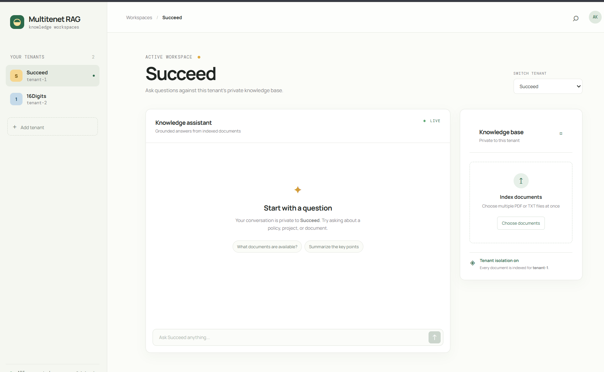
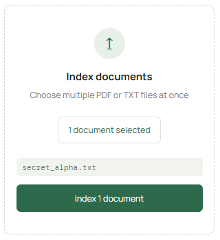
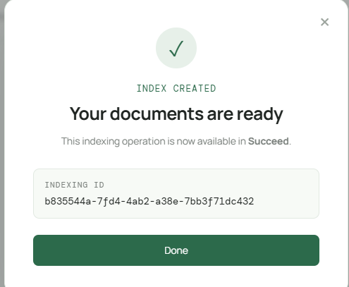
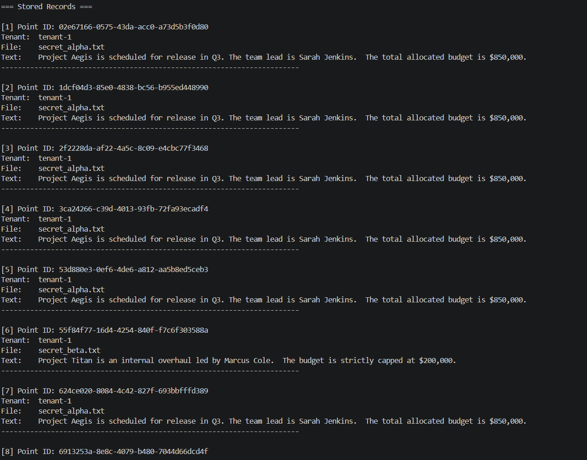

# 🏢 Privacy-First Multi-Tenant Local RAG System

A privacy-focused, fully local Retrieval-Augmented Generation (RAG) platform designed for multi-tenant architectures. It isolates each tenant's documents, vector embeddings, and search spaces using **Qdrant payload filtering** and **local Ollama models**, guaranteeing zero cross-tenant data leakage without relying on external cloud APIs.

---

## 📸 Visual Walkthrough

### 1. Web Application Overview
The main interface features an active tenant selector, file ingestion tools, and an isolated chat environment.



---

### 2. Document Ingestion Pipeline
Tenants upload `.pdf` or `.txt` files directly through the dashboard. Documents are automatically chunked, embedded via local models, and indexed under the active tenant's context.



---

### 3. Isolated Tenant Code & Session Generation
Each tenant operates in complete logical isolation. Dynamic tenant tagging enforces boundary checks across every upload and retrieval request.



---

### 4. Vector & Database Inspection
Stored document chunks, metadata, and tenant IDs indexed inside the database. Records remain partitioned so queries from one tenant cannot see data from another.



---

## ⚡ Core Architecture

* **Multi-Tenant Isolation:** Enforced via Qdrant payload filters (`tenant_id: <id>`) and dedicated keyword indices.
* **100% Local Inference:**
  * **Embeddings:** `nomic-embed-text` (768-dim) via Ollama.
  * **LLM Engine:** `llama3.2` via Ollama.
* **Persistent Storage:** Disk-backed Qdrant collection with crash-resilient locks.
* **Document Parser:** PyPDF and LangChain recursive character text splitters.

---

## 🚀 Quick Start

### 1. Prerequisites
* Python 3.10+
* [Ollama](https://ollama.com/) running locally

Pull required models:
```bash
ollama run llama3.2
ollama pull nomic-embed-text